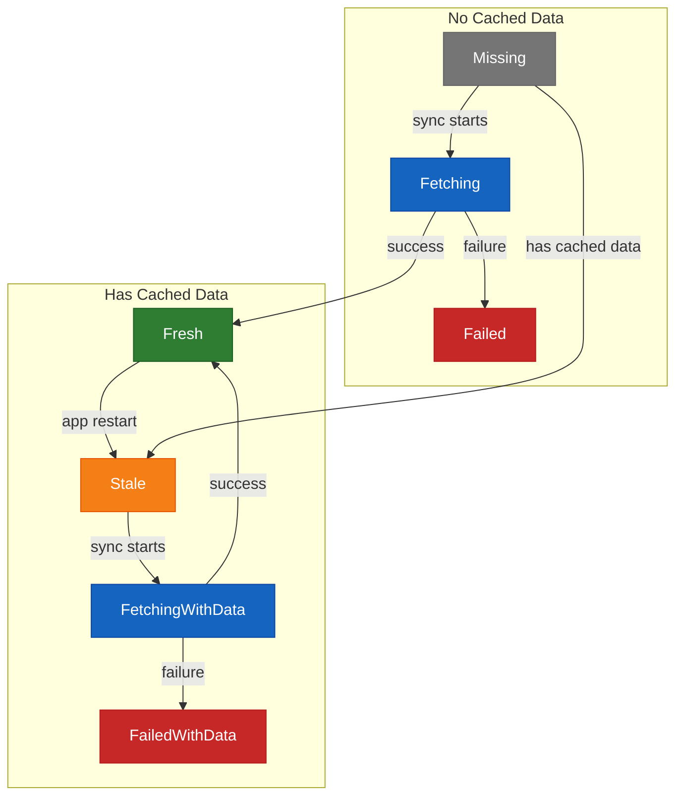

# PostMetadataCollectionWithEditContext

A mobile developer guide to displaying post lists using the wordpress-rs caching layer.

## Contents

1. [Overview](#1-overview)
2. [Data Flow Diagram](#2-data-flow-diagram)
3. [Creating a Collection](#3-creating-a-collection)
4. [Observing Data Changes](#4-observing-data-changes)
5. [Understanding Item States](#5-understanding-item-states)
6. [Handling User Interactions](#6-handling-user-interactions)
7. [Displaying Items in a List](#7-displaying-items-in-a-list)
8. [Lifecycle Management](#8-lifecycle-management)
9. [Types Reference](#9-types-reference)

---

## 1. Overview

`PostMetadataCollectionWithEditContext` is the primary type for efficiently loading and displaying a paginated list of posts. It uses a **two-phase sync strategy**:

1. **Phase 1 — Lightweight metadata:** Fetch only post IDs and modification timestamps from the API. This defines the list structure instantly.
2. **Phase 2 — Selective full data:** Only fetch full post data for items that are missing from the cache or have changed since the last fetch.

This means your list screen shows cached data immediately while only downloading what's actually needed.

> **Key Concept:** The collection is backed by a local SQLite database. All data flows through the database, and the UI is notified of changes via **observer callbacks**. You never need to manually wire API responses to your UI — the observer pattern handles it automatically.

---

## 2. Data Flow Diagram

The collection follows a **unidirectional data flow**: user actions trigger network fetches, results are written to the database, database changes notify observers, and observers tell your ViewModel to re-read from the cache. Data always flows in one direction through the system — your UI never receives API responses directly.

```mermaid
flowchart TD
    subgraph APP["YOUR APP (UI Layer)"]
        VM["ViewModel / Presenter"]
        UI["List UI"]
        LI["Loading / Error Indicators"]
    end

    subgraph WPRS["WORDPRESS-RS (Collection + Observers)"]
        COL["PostMetadataCollection\nloadItems() · refresh() · loadNextPage()"]
        API["WordPress REST API\nGET /wp/v2/posts\n_fields=id,modified_gmt (Phase 1)"]
        DO["Data Observer"]
        LIO["ListInfo Observer"]
    end

    subgraph DB["LOCAL DATABASE (SQLite)"]
        PD["Post Data"]
        LM["List Metadata"]
        LS["List State"]
    end

    VM -- "① refresh() then\nloadNextPage()" --> COL
    COL -- "② Fetch metadata\nfrom API" --> API
    API -- "③ Save to DB" --> DB
    DB -. "④ DB change\ntriggers observers" .-> DO
    DB -. "④ DB change\ntriggers observers" .-> LIO
    DO -. "⑤ Observer\ncallbacks fire" .-> VM
    LIO -. "⑤ Observer\ncallbacks fire" .-> VM
    VM -- "⑥ loadItems()" --> COL
    COL -- "⑦ Read cache" --> DB
    VM -- "⑧ Update UI" --> UI
    VM -- "⑧ Update UI" --> LI
```



**Data Flow Steps:**

1. App calls `refresh()` to load page 1 (required first), then `loadNextPage()` for subsequent pages
2. Collection fetches lightweight metadata (IDs + timestamps) from the WordPress API
3. Metadata is saved to the local database, then full data is fetched for missing/stale items
4. Database changes automatically trigger observer callbacks
5. Observer callbacks fire, notifying your ViewModel
6. ViewModel calls `loadItems()` to read from cache
7. Collection reads cached data from the database
8. ViewModel updates the list UI

---

## 3. Creating a Collection

A collection is created via the `PostService`, passing a filter and pagination config. Each unique filter creates a separate cache key — switching filters means creating a new collection, not reconfiguring the existing one.

**Kotlin:**

```kotlin
// Create a collection that shows published posts
val collection = postService
    .createPostMetadataCollectionWithEditContext(
        endpointType = PostEndpointType.POSTS,
        filter = PostListFilter(
            status = listOf(PostStatus.PUBLISH)
        ),
        perPage = 20u
    )

// Wrap it for observer support
val observable = createObservableMetadataCollection(
    collection
)
```

**Swift:**

```swift
// Create a collection that shows published posts
let collection = postService
    .createPostMetadataCollectionWithEditContext(
        endpointType: .posts,
        filter: PostListFilter(
            status: [.publish]
        ),
        perPage: 20
    )

// In Swift, call methods on the collection
// directly. See "Observing" section for
// how to wire up change notifications.
```

### PostListFilter

The filter determines which posts are included. Common fields:

| Field | Type | Description |
|-------|------|-------------|
| `status` | `[PostStatus]` | Filter by publish, draft, pending, etc. |
| `search` | `String?` | Full-text search query |
| `author` | `[UserId]` | Only show posts by specific authors |
| `orderby` | `PostOrderBy?` | Sort field (date, title, modified, etc.) |
| `order` | `Order?` | Sort direction (asc / desc) |

> **One filter = one collection.** When the user switches filters (e.g. from "Published" to "Drafts"), close the old collection and create a new one. Each filter has its own independent cache.

---

## 4. Observing Data Changes

The collection communicates changes through two types of observers. When the database changes (after a network fetch completes, after a post is edited, etc.), the relevant observers fire automatically.

| Observer | Fires when… | Your response |
|----------|-------------|---------------|
| `dataObserver` | List items change (posts added, removed, or updated; item states change) | Call `loadItems()` to get fresh data, then update the list UI |
| `listInfoObserver` | Pagination or sync state changes (page number updated, sync started/finished) | Call `listInfo()` to update loading indicators and pagination display |

**Kotlin:**

```kotlin
// Register observers
observable.addDataObserver {
    // Called on background thread
    viewModelScope.launch {
        val items = observable.loadItems()
        _uiState.value = _uiState.value.copy(
            items = items
        )
    }
}

observable.addListInfoObserver {
    val info = observable.listInfo()
    _uiState.value = _uiState.value.copy(
        isSyncing = info?.isSyncing == true,
        hasMorePages = info?.hasMorePages == true
    )
}

// Or use addObserver() to listen to both
```

**Swift:**

```swift
// Swift does not have the Kotlin
// ObservableMetadataCollection wrapper.
//
// Use the relevance-check methods to build
// your own observer in the
// DatabaseChangeNotifier callback:

func onDatabaseChange(_ hook: UpdateHook) {
    if collection.isRelevantDataUpdate(hook: hook) {
        Task {
            let items = try await collection
                .loadItems()
            await updateUI(items: items)
        }
    }
    if collection.isRelevantListInfoUpdate(hook: hook) {
        let info = collection.listInfo()
        await updateSyncState(info)
    }
}
```

---

## 5. Understanding Item States

Each item returned by `loadItems()` is a `PostMetadataCollectionItem` with three fields:

| Field | Type | Description |
|-------|------|-------------|
| `id` | `Int64` | WordPress post ID |
| `parent` | `Int64?` | Parent ID (for hierarchical types like pages) |
| `state` | `PostItemState` | Combined sync status + data (see below) |

The `state` field is an enum that encodes **both** the sync status and data availability in a single value. This makes it impossible to have inconsistent states like "fetching but also fresh".

### State Variants

| State | Has data? | Meaning | Recommended UI |
|-------|-----------|---------|----------------|
| `Fresh` | Yes | Data is up to date | Show the post normally |
| `Stale` | Yes | Data exists but may be outdated (e.g., after app restart) | Show the post normally (stale data is still usable) |
| `FetchingWithData` | Yes | Refreshing, but older cached data is available | Show the post + subtle loading indicator |
| `FailedWithData` | Yes | Fetch failed, but last-known cached data is available | Show the post + error badge |
| `Fetching` | No | Currently fetching, nothing cached | Show a placeholder / shimmer |
| `Missing` | No | Not yet fetched and nothing cached | Show a placeholder |
| `Failed` | No | Fetch failed and nothing cached | Show error message |

### State Transition Diagram



> **Practical tip:** In most list UIs, you can treat `Fresh`, `Stale`, `FetchingWithData`, and `FailedWithData` the same way — they all have displayable data. Only `Fetching`, `Missing`, and `Failed` need placeholder or error treatment.

---

## 6. Handling User Interactions

### Pull to Refresh

Call `refresh()`. This replaces the list with page 1 from the API and fetches any missing/stale items.

**Kotlin:**

```kotlin
fun onPullToRefresh() {
    viewModelScope.launch {
        try {
            val result = observable.refresh()
            // result.failedCount > 0 means
            // some items failed to fetch
        } catch (e: Exception) {
            // Network error — show error state
        }
    }
}
```

**Swift:**

```swift
func onPullToRefresh() async {
    do {
        let result = try await collection
            .refresh()
        // result.failedCount > 0 means
        // some items failed to fetch
    } catch {
        // Network error — show error state
    }
}
```

What happens under the hood:

1. `ListState` is set to `FetchingFirstPage` (listInfo observer fires — show spinner)
2. Lightweight metadata is fetched from the API (`_fields=id,modified_gmt`)
3. Metadata is saved to DB, replacing existing items (data observer fires — call `loadItems()`)
4. Full post data is fetched one-by-one for missing/stale items (data observer fires after each)
5. `ListState` is set to `Idle` (listInfo observer fires — hide spinner)

### Continuous Scrolling (Load Next Page)

Call `loadNextPage()` when the user scrolls near the end of the list. The collection handles edge cases automatically — calling it when already on the last page is a safe no-op.

**Kotlin:**

```kotlin
fun onScrolledNearEnd() {
    val info = observable.listInfo()

    // Guard: skip if already loading or
    // no more pages
    if (info?.isSyncing == true) return
    if (info?.hasMorePages == false) return

    viewModelScope.launch {
        observable.loadNextPage()
    }
}
```

**Swift:**

```swift
func onScrolledNearEnd() async {
    let info = collection.listInfo()

    // Guard: skip if already loading or
    // no more pages
    guard info?.state == .idle else { return }
    guard collection.hasMorePages() != false
        else { return }

    _ = try? await collection.loadNextPage()
}
```

What happens under the hood:

1. `ListState` is set to `FetchingNextPage`
2. Metadata for the next page is fetched and **appended** (not replaced) to the existing list
3. Missing/stale items from the new page are fetched
4. `ListState` is set to `Idle`

### Changing Filters

When the user switches between post lists (e.g. "Published" to "Drafts"), you need to close the old collection and create a new one.

**Kotlin:**

```kotlin
fun onFilterChanged(newFilter: PostListFilter) {
    // Close old collection
    observable.close()

    // Create new collection with new filter
    val newCollection = postService
        .createPostMetadataCollectionWithEditContext(
            endpointType, newFilter, 20u
        )
    observable = createObservableMetadataCollection(
        newCollection
    )

    // Re-register observers...
    // Load cached items for new filter
    viewModelScope.launch {
        val items = observable.loadItems()
        // May be empty if never synced
        updateUI(items)
        // Trigger a refresh to sync
        observable.refresh()
    }
}
```

**Swift:**

```swift
func onFilterChanged(
    _ newFilter: PostListFilter
) async {
    // Create new collection with new filter
    collection = postService
        .createPostMetadataCollectionWithEditContext(
            endpointType: .posts,
            filter: newFilter,
            perPage: 20
        )

    // Load cached items for new filter
    let items = try? await collection
        .loadItems()
    // May be empty if never synced
    updateUI(items: items ?? [])
    // Trigger a refresh to sync
    _ = try? await collection.refresh()
}
```

---

## 7. Displaying Items in a List

When `loadItems()` returns, iterate over the items and use pattern matching on the `state` field to decide what to display.

**Kotlin:**

```kotlin
@Composable
fun PostList(items: List<PostMetadataCollectionItem>) {
    LazyColumn {
        items(items, key = { it.id }) { item ->
            when (val state = item.state) {
                // States WITH data — show the post
                is PostItemState.Fresh ->
                    PostRow(post = state.data)
                is PostItemState.Stale ->
                    PostRow(post = state.data)
                is PostItemState.FetchingWithData ->
                    PostRow(post = state.data, isLoading = true)
                is PostItemState.FailedWithData ->
                    PostRow(post = state.data, error = state.error)

                // States WITHOUT data — show placeholders
                is PostItemState.Fetching ->
                    PostRowShimmer()
                is PostItemState.Missing ->
                    PostRowShimmer()
                is PostItemState.Failed ->
                    PostRowError(error = state.error)
            }
        }
    }
}
```

**Swift:**

```swift
struct PostListView: View {
    let items: [PostMetadataCollectionItem]

    var body: some View {
        List(items, id: \.id) { item in
            switch item.state {
            // States WITH data — show the post
            case .fresh(let data):
                PostRow(post: data)
            case .stale(let data):
                PostRow(post: data)
            case .fetchingWithData(let data):
                PostRow(post: data, isLoading: true)
            case .failedWithData(let error, let data):
                PostRow(post: data, error: error)

            // States WITHOUT data — show placeholders
            case .fetching:
                PostRowShimmer()
            case .missing:
                PostRowShimmer()
            case .failed(let error):
                PostRowError(error: error)
            }
        }
    }
}
```

### The Data Object

When a state variant carries `data`, it is a `FullEntityAnyPostWithEditContext` containing:

| Field | Type | Description |
|-------|------|-------------|
| `entityId` | `EntityId` | Database identity (site + type + WordPress ID) |
| `data` | `AnyPostWithEditContext` | The full WordPress post object |

Use `data.title`, `data.status`, `data.dateGmt`, etc. to access post fields for display.

---

## 8. Lifecycle Management

**Kotlin:**

```kotlin
class PostListViewModel : ViewModel() {
    private lateinit var observable:
        ObservableMetadataCollection

    init {
        // Create & setup in init
        observable = postService
            .getObservablePostMetadata...()
        observable.addObserver { reload() }
        viewModelScope.launch { observable.refresh() }
    }

    override fun onCleared() {
        super.onCleared()
        // IMPORTANT: always close to unregister
        // from DatabaseChangeNotifier
        observable.close()
    }
}
```

**Swift:**

```swift
@MainActor
class PostListViewModel: ObservableObject {
    private var collection:
        PostMetadataCollectionWithEditContext?

    func setup() {
        collection = postService
            .createPostMetadataCollection...()
    }

    // The Swift collection object is
    // reference-counted. Setting it to nil
    // (or letting the ViewModel deallocate)
    // releases the Rust-side resources.
    deinit {
        collection = nil
    }
}
```

---

## 9. Types Reference

### ListInfo

Returned by `listInfo()`. A snapshot of pagination and sync state in a single query.

| Field | Type | Description |
|-------|------|-------------|
| `state` | `ListState` | Current sync state (see below) |
| `errorMessage` | `String?` | Error details when state is `Error` |
| `currentPage` | `UInt32?` | Last loaded page number (`null` = not loaded) |
| `totalPages` | `UInt32?` | Total pages reported by the API |
| `totalItems` | `Int64?` | Total items reported by the API |
| `perPage` | `UInt32` | Number of items per page |

### ListState

| Value | Meaning | UI Guidance |
|-------|---------|-------------|
| `Idle` | No sync in progress | Normal state |
| `FetchingFirstPage` | Refresh in progress | Show pull-to-refresh spinner |
| `FetchingNextPage` | Loading more items | Show bottom loading indicator |
| `Error` | Last sync failed | Show error banner / retry button |

### SyncResult

Returned by `refresh()` and `loadNextPage()`.

| Field | Type | Description |
|-------|------|-------------|
| `totalItems` | `UInt64` | Number of items in list after sync |
| `fetchedCount` | `UInt64` | Items that were fetched from the API |
| `failedCount` | `UInt64` | Items that failed to fetch |
| `hasMorePages` | `Bool?` | Whether more pages are available |
| `currentPage` | `UInt32?` | Page number after this sync |
| `totalPages` | `UInt32?` | Total pages known |

### Key Methods on the Collection

| Method | Async? | Returns | Purpose |
|--------|--------|---------|---------|
| `loadItems()` | Yes | `[PostMetadataCollectionItem]` | Read items from cache with their states |
| `refresh()` | Yes | `SyncResult` | Fetch page 1 and sync missing/stale items |
| `loadNextPage()` | Yes | `SyncResult` | Fetch the next page and sync its items |
| `listInfo()` | No | `ListInfo?` | Get pagination + sync state |
| `hasMorePages()` | No | `Bool?` | Whether more pages exist |
| `currentPage()` | No | `UInt32?` | Current page number |
| `totalPages()` | No | `UInt32?` | Total pages count |
| `syncState()` | Yes | `ListState` | Current sync state |
| `isRelevantDataUpdate(hook)` | No | `Bool` | Check if a DB change affects list data |
| `isRelevantListInfoUpdate(hook)` | No | `Bool` | Check if a DB change affects list info |
