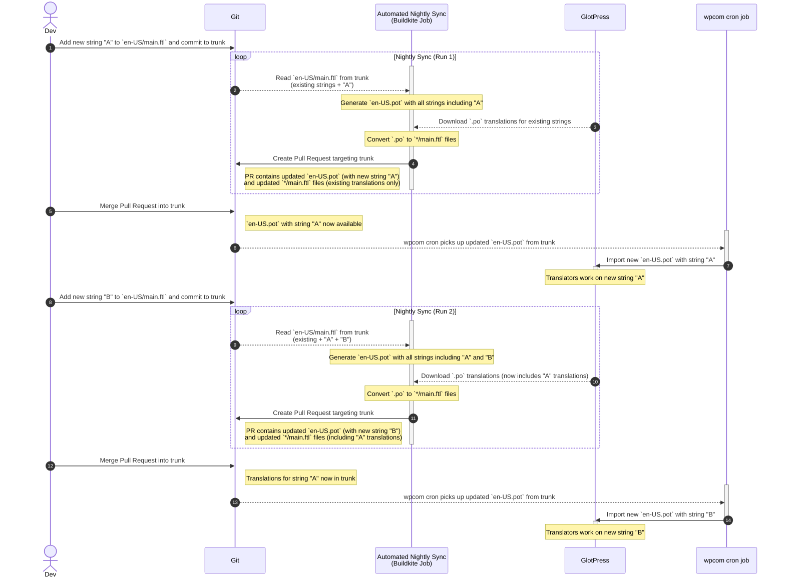

# Localization

This directory contains the localization files for `wordpress-rs`, enabling a translation workflow between Fluent localization files (`.ftl`) and GlotPress.

We use GlotPress as a platform/service to have translators translate our strings from English to other languages.
But GlotPress does not support Rust's Fluent `.ftl` format as an input/output file format.

To circumvent that, during the localization automation process, we convert the `localization/en-US/main.ftl` file to the PO format in `glopress/en-US.pot` so that a cron job can then later pick up that `.pot` file and upload it to GlotPress and send it to translators.
This transformation is handled by `bundle exec fastlane generate_source_po_file`.

Later we then download the translations from GlotPress (which are exported in the `.po` format), then regenerate the `localization/*/main.ftl` files for each language based on those downloaded translated `.po` files.
This is handled by `bundle exec fastlane download_translations`

_Note that we have to commit the `glotpress/en-US.pot` file here because that file is picked up by a cron job in our systems on a regular basis (as opposed to the `.pot` being sent via API on demand) given how those imports are integrated in our systems._

## Workflow for Developers

### Automated Nightly Sync

The localization process runs automatically every night via a Buildkite pipeline (`.buildkite/nightly.yml`). This automated job:

1. **Generates the source en-US PO file** from `localization/en-US/main.ftl` and commits it to `glotpress/en-US.pot`
2. **Downloads latest translations** from GlotPress for all supported locales as PO files
3. **Converts downloaded PO files to Fluent format** and updates the corresponding `localization/*/main.ftl` files
4. **Creates a Pull Request** targeting `trunk` with the updated translation files and the updated original en-US PO file in the repository.
   - If a previous localization sync Pull Request was still open at the time the nightly sync happens, that previous Pull Request will be closed and a new one will be opened with the latest translations to take its place.

Once you merge the Pull Request into `trunk`, the updated `glotpress/en-US.pot` file will be picked up by a wpcom job to import it into GlotPress, so that translators can start working on the new strings.

This means that translation updates happen automatically without developer intervention.

### Adding New Localization Strings

To add or update new localizable strings to the project, just edit `wp_localization/localization/en-US/main.ftl` to add or update them, using the English copy.

[The "Automated Nightly Sync" described above](#automated-nightly-sync) will take care of the rest.

### Manual Operations (Optional)

If you need to run the localization sync manually instead of waiting for the nightly job:

**Generate source PO file:**
```bash
bundle exec fastlane generate_source_po_file
```

**Download GlotPress translations and generate local Fluent translation files:**
```bash
bundle exec fastlane download_translations
```

**Runs both lanes above and creates a new Pull Request with the changes targeting `trunk`:**
```bash
bundle exec fastlane sync_localization
```

### Helper Lanes

- **`download_po_files_from_glotpress`**: Downloads PO files for all supported locales
- **`generate_fluent_file_from_po`**: Converts individual PO files back to Fluent format

## Localization Process Flow

Here's a visual representation of the typical localization workflow:



## References

- **Fluent format**: Uses [Project Fluent](https://projectfluent.org/) for localization files
- **PO format**: Standard [gettext](https://www.gnu.org/software/gettext/manual/gettext.html) format used by GlotPress
- **Conversion tool**: Uses the [fluent-tools](https://github.com/Automattic/fluent-rust-tools) CLI and Ruby Gem for format conversion
- **GlotPress integration**: Downloads translations from `https://translate.wordpress.com/projects/mobile/wordpress-rs`
